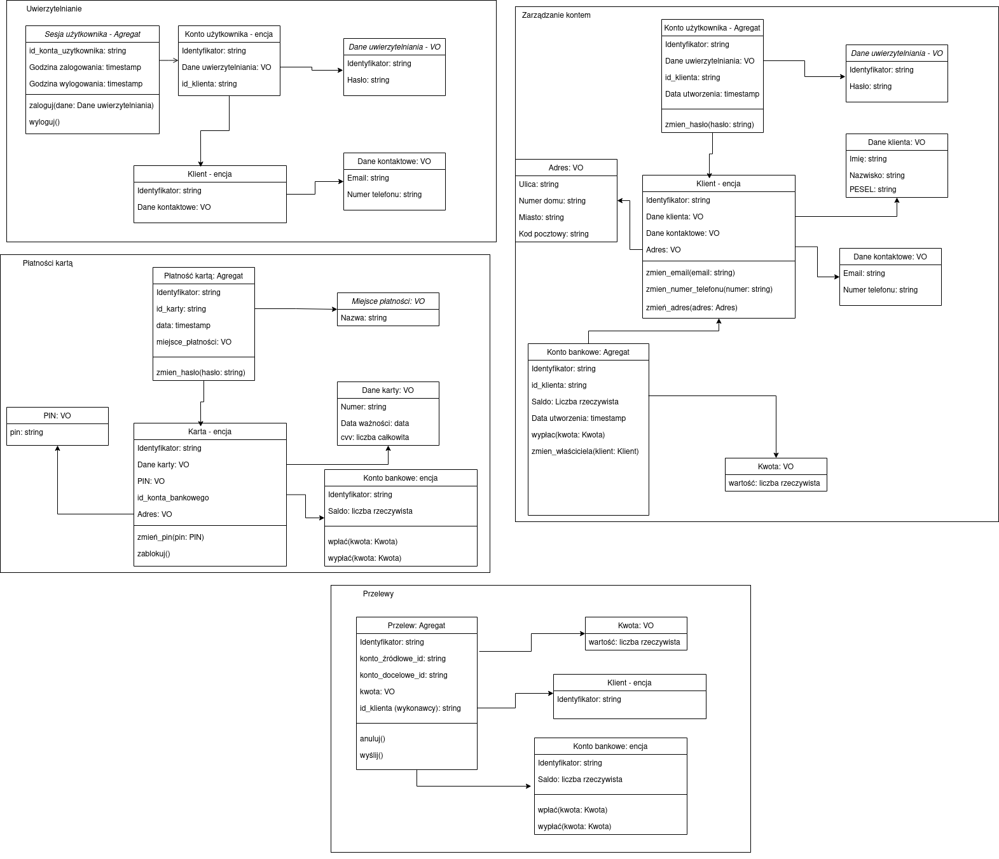

# Zadanie 1 - Domain driven design

W swoim modelu skupiłem się na czterech obszarach - uwierzytelnianiu, zarządzaniu kontem, przelewach i płatnościach kartą.
W większości kontekstów występuje po jednym agregacie, jednak w zarządzaniu kontem są dwa. Poniżej wypisałem zdefiniowane
obiekty modelu. Ich właściwości oraz metody wylistowałem na obrazku z modelem. W poszczególnych kontekstach encje mogą różnić się od siebie.
Wynika to z faktu, że nie wszystkie dane konkretnej encji są wymagane w danym kontekście.

## Konteksty
1. Uwierzytelnianie
2. Zarządzanie kontem
3. Przelewy
4. Płatności kartą

## Modelowanie
### Agregaty:
Sesja Użytkownika, Konto użytkownika (w kontekscie zarządzania kontem), Konto bankowe (w kontekscie zarządzania kontem), Płatność kartą, Przelew
### Encje:
Klient, karta, konto użytkownika (w kontekscie uwierzytelniania), Konto bankowe (w kontekscie przelewów i płatności kartą)
### Value objects:
Dane uwierzutelniania, Dane kontaktowe, Miejsce płatności, PIN, Dane karty, Kwota, Dane klienta, Dane kontaktowe, Adres

